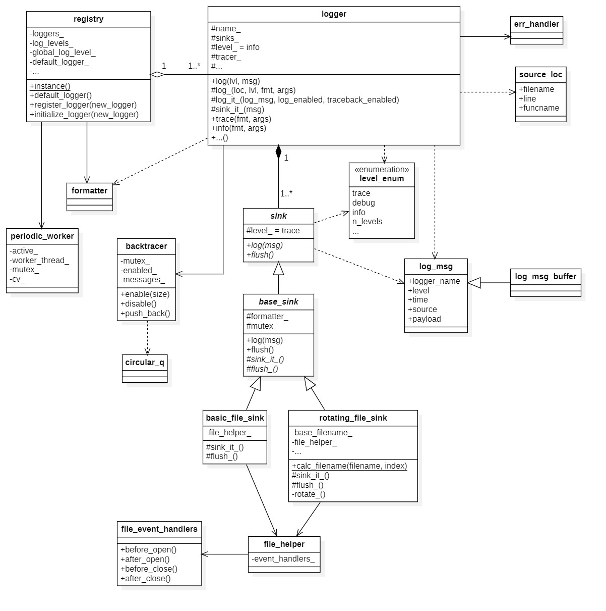

## 一、开端

### 1.1. 总览

```C++
//选自 https://www.cnblogs.com/shuqin/p/12214439.html
spdlog
    ├─example  用法代码
    ├─include  实现目录
    │  └─spdlog
    │      ├─details  功能函数目录
    │      ├─fmt  {fmt} 库目录
    │      ├─sinks  落地文件格式实现
    │      └─*.h    异步模式，日志库接口等实现
    ├─src  .cpp 文件，组成编译模块生成静态库使用
    ├─test  测试代码
```

别人画的类图([spdlog源码分析-整体框架_spdlog架构_注定会的博客-CSDN博客](https://blog.csdn.net/csenjoy/article/details/96337751?spm=1001.2014.3001.5502))：


### 1.2. level

日志的级别在`include\spdlog\common.h`中，由枚举`level_enum`给出。由低到高为`trace debug info warn err critical off`。**默认级别为info(define SPDLOG_ACTIVE_LEVEL SPDLOG_LEVEL_INFO)**

相关主要函数有`to_string_view`和`from_str`，功能分别为根据枚举获取字符串和根据字符串获取枚举值。

这些内容都在`namespace level`中


## 二、example

这节简单看一下example。

**几点发现：**

1. 支持格式化、多线程、异步、多输出目标、计时、自定义类型格式化、自定义异常信息处理等功能
2. **spdlog::[info/warn/...]**使用的是默认的logger作为输出
3. **spdlog::xxx_xxx_[mt/st]**为自己新建logger时用的api。

下阶段**目标**是看懂默认的输出(以info为例)。

输出一条日志的过程大致为：`spdlog::info -> details::registry中的默认logger.info -> 构造details::log_msg -> logger::log_it_ -> 该logger的所有sink.log`

看起来要先弄清 details::log_msg和sink。


## 三、details::log_msg

### 3.1. source_loc结构体

位于`include\spdlog\common.h`。记录了打日志的地方所在的文件名、行数、函数名

```c++
struct source_loc
{
    SPDLOG_CONSTEXPR source_loc() = default; 
    SPDLOG_CONSTEXPR source_loc(const char *filename_in, int line_in, const char *funcname_in)
        : filename{filename_in}
        , line{line_in}
        , funcname{funcname_in}
    {}

    SPDLOG_CONSTEXPR bool empty() const SPDLOG_NOEXCEPT
    {
        return line == 0;
    }
    const char *filename{nullptr};
    int line{0};
    const char *funcname{nullptr};
};
```

SPDLOG_CONSTEXPR宏在我的环境下被扩展成了`constexpr`。

**constexpr构造函数**，把这个类变为一个**"字面值常量类"**（https://blog.csdn.net/craftsman1970/article/details/80244873）。constexpr构造函数的函数体一般为空，使用初始化列表或者其他的constexpr构造函数初始化所有数据成员。

**constexpr修饰其它函数**，将运算尽量放在编译阶段。函数只能有一个return语句

 **= default** 启用默认的构造函数

SPDLOG_NOEXCEPT宏在我的环境下被扩展成了`noexcept`。该关键字告诉编译器，函数中不会发生异常，这有利于编译器对程序做更多的优化。如果在运行时，noexecpt函数向外抛出了异常（如果函数内部捕捉了异常并完成处理，这种情况不算抛出异常），程序会直接终止，调用std::terminate()函数，该函数内部会调用std::abort()终止程序

### 3.2. log_msg

构造函数中提供了多种构造。成员如下，包括logger名、级别、线程id、位置等

```c++
    string_view_t logger_name;
    level::level_enum level{level::off};
    log_clock::time_point time; //using log_clock = std::chrono::system_clock; time_point表示一个时间点
    size_t thread_id{0};

    // wrapping the formatted text with color (updated by pattern_formatter).
    mutable size_t color_range_start{0};
    mutable size_t color_range_end{0};

    source_loc source;
    string_view_t payload; //存储的是msg
```

构造时如果不指定时间，默认为当前时间。


## 四、sinks

所有的sink都在`include\spdlog\sinks`目录下。

### 4.1. sink

`sink.h`中的`sink`类为纯虚的抽象类。其中待实现的接口如下：

```c++
    virtual void log(const details::log_msg &msg) = 0;
    virtual void flush() = 0;
    virtual void set_pattern(const std::string &pattern) = 0;
    virtual void set_formatter(std::unique_ptr<spdlog::formatter> sink_formatter) = 0;
```

已实现的接口如下：

```c++
    void set_level(level::level_enum log_level);
    level::level_enum level() const;
    bool should_log(level::level_enum msg_level) const;
```

`should_log`实现如下：

```c++
SPDLOG_INLINE bool spdlog::sinks::sink::should_log(spdlog::level::level_enum msg_level) const
{
    // std::memory_order_relaxed: 仅仅保证load()和store()是原子操作，除此之外，不提供任何跨线程的同步
    return msg_level >= level_.load(std::memory_order_relaxed);
}
```

当**传入的level大于等于sink的level**时则通过。

有成员：

```c++
level_t level_{level::trace}; // using level_t = std::atomic<int>;
//可见sink的默认级别为trace(级别0)
```

### 4.2. base_sink

```c++
template<typename Mutex>
class SPDLOG_API base_sink : public sink
{
public:
    base_sink();
    // explicit禁止构造函数被用于隐式转换
    explicit base_sink(std::unique_ptr<spdlog::formatter> formatter);
    ~base_sink() override = default;

    base_sink(const base_sink &) = delete;
    base_sink(base_sink &&) = delete;

    base_sink &operator=(const base_sink &) = delete;
    base_sink &operator=(base_sink &&) = delete;

    // 下面这几个是继承来的纯虚函数。final阻止了这些虚函数被子类重载
    void log(const details::log_msg &msg) final;
    void flush() final;
    void set_pattern(const std::string &pattern) final;
    void set_formatter(std::unique_ptr<spdlog::formatter> sink_formatter) final;

protected:
    // sink formatter
    std::unique_ptr<spdlog::formatter> formatter_;
    Mutex mutex_;

    virtual void sink_it_(const details::log_msg &msg) = 0;
    virtual void flush_() = 0;
    virtual void set_pattern_(const std::string &pattern);
    virtual void set_formatter_(std::unique_ptr<spdlog::formatter> sink_formatter);
};
```

继承来的4个虚函数调用protected里面的4个函数，调用前都用`std::lock_guard<Mutex> lock(mutex_)`加了锁。`sink_it_`函数负责将msg格式化成字符串buffer以及输出；`flush_`将缓冲区的内容写入输出。

其它的xxx_sink要么继承sink，要么继承base_sink。

### 4.3. basic_file_sink

以basic_file_sink为例子1，该类继承自`base_sink<Mutex>`。

```c++
template<typename Mutex>
class basic_file_sink final : public base_sink<Mutex>
{
public:
    explicit basic_file_sink(const filename_t &filename, bool truncate = false, const file_event_handlers &event_handlers = {});
    const filename_t &filename() const;

protected:
    void sink_it_(const details::log_msg &msg) override;
    void flush_() override;

private:
    details::file_helper file_helper_;
};
```

上面`sink_it_`函数负责格式化msg(调用`base_sink<Mutex>`中`formatter_`成员的接口`format`)以及将格式化后的结果输出到文件。

`file_event_handlers`如下。用于定义打开和关闭文件所调用的操作。

```c++
struct file_event_handlers
{
    std::function<void(const filename_t &filename)> before_open;
    std::function<void(const filename_t &filename, std::FILE *file_stream)> after_open;
    std::function<void(const filename_t &filename, std::FILE *file_stream)> before_close;
    std::function<void(const filename_t &filename)> after_close;
    file_event_handlers()
        : before_open{nullptr}
        , after_open{nullptr}
        , before_close{nullptr}
        , after_close{nullptr}
    {}
};
```

`details::file_helper`用来完成一些文件打开、关闭、写入、flush等操作。同时联动`file_event_handlers`，如下。除了默认构造函数，还提供了个接受`file_event_handlers`的构造函数。析构调用`close()`.

```c++
SPDLOG_INLINE void file_helper::close()
{
    if (fd_ != nullptr)
    {
        if (event_handlers_.before_close)
        {
            event_handlers_.before_close(filename_, fd_);
        }

        std::fclose(fd_);
        fd_ = nullptr;

        if (event_handlers_.after_close)
        {
            event_handlers_.after_close(filename_);
        }
    }
}
```

对于单线程和多线程的`basic_file_sink`，定义了2个类型：

```c++
using basic_file_sink_mt = basic_file_sink<std::mutex>;
using basic_file_sink_st = basic_file_sink<details::null_mutex>;
```

其中，`details::null_mutex`如下，就是把`std::lock_guard<Mutex> lock(mutex_)`中**需要的操作都变为“空”**即可，有点巧妙。在文件`include\spdlog\details\null_mutex.h`中。

```c++
struct null_mutex
{
    void lock() const {}
    void unlock() const {}
    bool try_lock() const
    {
        return true;
    }
};
```

`basic_file_sink.h`中暴露出了下面2个函数，分别构造默认的多/单线程logger。

```c++
template<typename Factory = spdlog::synchronous_factory>
inline std::shared_ptr<logger> basic_logger_mt(
    const std::string &logger_name, const filename_t &filename, bool truncate = false, const file_event_handlers &event_handlers = {})

template<typename Factory = spdlog::synchronous_factory>
inline std::shared_ptr<logger> basic_logger_st(
    const std::string &logger_name, const filename_t &filename, bool truncate = false, const file_event_handlers &event_handlers = {})
```

具体是调用synchronous_factory的`create`函数实现。函数信息如下。创建logger同时会向注册中心`(details::registry)`注册该logger。

```c++
template<typename Sink, typename... SinkArgs>
static std::shared_ptr<spdlog::logger> create(std::string logger_name, SinkArgs &&... args)
```

### 4.4. rotating_file_sink

以rotating_file_sink为例子2。Rotating file即当一个日志文件达到指定大小后，就创建一个新的日志文件，以防止一个日志文件过大。

```c++
template<typename Mutex>
class rotating_file_sink final : public base_sink<Mutex>
{
public:
    rotating_file_sink(filename_t base_filename, std::size_t max_size, std::size_t max_files, bool rotate_on_open = false,
        const file_event_handlers &event_handlers = {});
    static filename_t calc_filename(const filename_t &filename, std::size_t index);
    filename_t filename();

protected:
    void sink_it_(const details::log_msg &msg) override;
    void flush_() override;

private:
    // Rotate files:
    // log.txt -> log.1.txt
    // log.1.txt -> log.2.txt
    // log.2.txt -> log.3.txt
    // log.3.txt -> delete
    void rotate_();

    // delete the target if exists, and rename the src file  to target
    // return true on success, false otherwise.
    bool rename_file_(const filename_t &src_filename, const filename_t &target_filename);

    filename_t base_filename_;
    std::size_t max_size_;
    std::size_t max_files_;
    std::size_t current_size_;
    details::file_helper file_helper_;
};
```

可以看到，总体上和basic_file_sink差不多，都有`sink_it_`、`flush_`函数以及`file_helper_`。不同的是多了些进行rotating需要的函数和属性。

这部分函数的注释本身写得就比较清楚，这里我们重点关注`rotate_`。通过该函数的实现，结合本身提供的注释可以发现，rotating的实现是**通过重命名的方式**将已经存在的文件编号+1，最早创建的文件(编号最大的)删除。整个过程中`file_helper_`的内容始终是关于index=0的文件(即`base_filename`)。`rotate_`之后index=0的文件会被清空(原先index=0的文件变为index=1)。

`sink_it_`主要的功能仍然是将msg进行格式化并写入文件。与`base_file_sink`不同的是，如果写入后的文件大小超过了预定值，则会先`rotate_`再写入。

与`base_file_sink`一样，`rotating_file_sink`也暴露出了构造默认的多/单线程logger的函数，长得和`base_file_sink`的差不多，这里就不分析了。


从上面的例子可以看出，各种sink的核心函数还是`sink_it_`和`flush_`。对于不同的sink，还会有辅助该sink的一些函数。目录`include\spdlog\sinks`下有其它的sink，感兴趣可以看看。


## 五、普通logger

从第二节example中分析的大致过程来看，sink看完了就可以看看logger。看起来这个类就很重要。相关内容在`include\spdlog\logger.h`和`include\spdlog\logger-inl.h`。

### 5.1. logger

属性如下：

```c++
protected:
    std::string name_;
    std::vector<sink_ptr> sinks_;
    spdlog::level_t level_{level::info};
    spdlog::level_t flush_level_{level::off};
    err_handler custom_err_handler_{nullptr};
    details::backtracer tracer_;
```

`name_`、`sinks_`、`level_`、`flush_level_`比较好理解，表示logger的名字、含有的sink、logger级别、进行flush操作的级别。`custom_err_handler_`根据名字推测是用户自定义的错误处理方法之类的。`tracer_`的作用可以根据`details::backtracer`类提供的注释和`example.cpp`中的代码得到，作用是把若干条log_msg存到一个循环buffer中(具体是**循环队列**)。需要时再将buffer里面的log_msg输出。

下面看函数。

映入眼帘的就是一堆构造函数和一堆接受各种各样参数的`log`函数。

构造函数这就不说了，我们重点放在`log`函数中。

这些`log`函数互相调用，形成调用链，参数少的添加默认值后调用参数多的。根据传入`log`的参数，可以把调用链分成2大类：

1. 参数中**不含有格式化字符串**(即"aa{}aa"这种)且要输出的内容**只含有string_view_t类型**(我的理解是字符串字面值)：这一类的`log`函数最终会调用下面两个函数：

   ```c++
   //如果有time_point传入，则调用第一个。
   
   void log(log_clock::time_point log_time, source_loc loc, level::level_enum lvl, string_view_t msg)
   
   void log(source_loc loc, level::level_enum lvl, string_view_t msg)
   ```

   在这两个函数中会构造`details::log_msg`并调用`log_it_`进行输出。

2. 其它。即含有格式化字符串**或**要输出的内容是其它类型(如int)：这类函数最终会调用下面的`log_`：

   ```c++
   template<typename... Args>
   void log_(source_loc loc, level::level_enum lvl, string_view_t fmt, Args &&...args)
   ```

   在`log_`中会格式化字符串、构造`details::log_msg`并调用`log_it_`进行输出。

因此，**所有的`log`函数最终都会构造`details::log_msg`并调用`log_it_`**。下面我们来看看`log_it_`到底是啥。

```c++
SPDLOG_INLINE void logger::log_it_(const spdlog::details::log_msg &log_msg, bool log_enabled, bool traceback_enabled)
{
    if (log_enabled)
    {
        sink_it_(log_msg);
    }
    if (traceback_enabled)
    {
        tracer_.push_back(log_msg);
    }
}
```

可以看出，如果level符合输出要求，则调用logger的`sink_it_`进行输出。如果使用tracer的话，还会将该log_msg缓存进tracer。

因此再看看`sink_it_`:

```c++
SPDLOG_INLINE void logger::sink_it_(const details::log_msg &msg)
{
    for (auto &sink : sinks_)
    {
        if (sink->should_log(msg.level))
        {
            SPDLOG_TRY
            {
                sink->log(msg);
            }
            SPDLOG_LOGGER_CATCH(msg.source)
        }
    }

    if (should_flush_(msg))
    {
        flush_();
    }
}
```

可以看出，核心内容为检查每个sink的level是否达到输出要求，并让符合要求的sink调用它的`log`函数进行输出。sink的相关函数在第四节进行过分析。

logger和sink都有`should_log`函数。从`should_log`的代码可以看出，一条msg要想被输出，**其level必需大于等于logger的level以及sink的level**。

至此，logger的核心部分就介绍完了！

### 5.2. backtracer

讲完了核心部分，下面就看看logger中的`details::backtracer`类型的成员`tracer_`吧。相关文件在`include\spdlog\details\backtracer.h`以及`include\spdlog\details\backtracer-inl.h`。

根据前面提到的，`backtracer`是用来存储若干条log_msg，并在需要时一次性将存储的log_msg输出。知道这一点后再度源码应该会更容易理解。类的属性如下：

```c++
    mutable std::mutex mutex_;
    std::atomic<bool> enabled_{false};
    circular_q<log_msg_buffer> messages_;
```

其中，`mutex_`用于多线程互斥；`enabled_`判断该tracer是否开启；`messages_`为tracer中存储的所有信息。

`messages_`的类型中，`circular_q`为循环队列；`log_msg_buffer`为tracer存储的log_msg信息，包括logger_name和payload。

为什么不直接存log_msg类，而要弄一个`log_msg_buffer`呢？根据`log_msg_buffer`的注释和实现，我**个人推测**是因为log_msg中的logger_name和payload是`string_view_t`类型，是在**栈区**，而这里需要把它们放到**堆区**，所以搞了个`log_msg_buffer`。

个人认为，比较核心的成员函数为`enable(size_t size)`和`disable`。

- **enable(size_t size)**

  将属性`enabled_`改为true，并设置`messages_`最多存储`size`条数据。

- **disable**

  将属性`enabled_`改为false

### 5.3. err_handler

接着看看logger的最后一个成员属性：`custom_err_handler_`，类型为`err_handler`，定义在`include\spdlog\common.h`：

```c++
using err_handler = std::function<void(const std::string &err_msg)>;
```

其实`custom_err_handler_`就是一个函数，用于对错误消息进行处理，在`err_handler_`成员函数中被调用：

```c++
SPDLOG_INLINE void logger::err_handler_(const std::string &msg)
{
    if (custom_err_handler_)
    {
        custom_err_handler_(msg);
    }
    else
    {
        //默认err_handler
    }
}
```

而`err_handler_`成员函数在对logger进行try-catch时被调用，是由宏`SPDLOG_LOGGER_CATCH(location)`负责。

至此，我们便介绍完了logger的部分。

## 六、registry

还记得我们的目标吗：看懂**默认**的输出(以info为例)。这是最后一步啦！

### 6.1. registry

`registry`是用来**管理所有的logger**的。首先浏览一下成员属性和成员函数。`registry`的成员属性较多，因此等用到的时候再介绍。注意到它的构造函数是私有的，并且有个`static registry &instance();`函数，可以判断这玩意是个**单例**。

看看默认构造函数：

```c++
SPDLOG_INLINE registry::registry()
    : formatter_(new pattern_formatter())
{

#ifndef SPDLOG_DISABLE_DEFAULT_LOGGER
    // create default logger (ansicolor_stdout_sink_mt or wincolor_stdout_sink_mt in windows).
#    ifdef _WIN32
    auto color_sink = std::make_shared<sinks::wincolor_stdout_sink_mt>();
#    else
    auto color_sink = std::make_shared<sinks::ansicolor_stdout_sink_mt>();
#    endif

    const char *default_logger_name = "";
    default_logger_ = std::make_shared<spdlog::logger>(default_logger_name, std::move(color_sink));
    loggers_[default_logger_name] = default_logger_;

#endif // SPDLOG_DISABLE_DEFAULT_LOGGER
}
```

**默认的sink为带颜色的sink**，根据平台的不同，在wincolor_stdout_sink_mt和ansicolor_stdout_sink_mt中选择。**默认的logger名字为空字符串**，并将该logger保存到成员`default_logger_`，且由成员`loggers_`记录。`loggers_`是一个哈希表，**保存由logger_name到logger的映射**。

继续看成员函数。

- **`void register_logger(std::shared_ptr<logger> new_logger)`**

注册一个新logger，也即添加一个logger。如果logger名字已存在则抛出异常。

- **`void initialize_logger(std::shared_ptr<logger> new_logger)`**

根据`registry`自身的成员变量设置传入logger的属性，如formatter、error_handler、level等。如果开启自动注册，则会将new_logger添加进`loggers_`当中。

- **`void set_default_logger(std::shared_ptr<logger> new_default_logger)`**

顾名思义，如果不想要它默认的logger的话，就手动设置默认logger。

- **`logger *get_default_raw()`**

`default_logger_`成员属性是一个智能指针。这个函数的作用是**获取其原始指针**(raw ptr)。这个函数是用于spdlog的默认api，如spdlog::info。它可以让默认api更快。但是**默认api不能与`set_default_logger`成员函数在不同线程同时使用，**否则logger就会串了。

- **`void flush_every(std::chrono::seconds interval)`**

每隔一定周期就调用`flush_all`成员函数(由于`flush_all`较简单，这里就不介绍)，让所有logger都flush一遍。最后再给成员`periodic_flusher_`赋值。`periodic_flusher_`是一个`periodic_worker`类的实例。`periodic_worker`根据名字看，是负责以一定周期实行某个任务，我们在后面会介绍它。

- **`void apply_all(const std::function<void(const std::shared_ptr<logger>)> &fun)`**

将传入的`fun`运用在所有logger上。

-  **`void set_levels(log_levels levels, level::level_enum *global_level)`**

`log_levels `定义为`using log_levels = std::unordered_map<std::string, level::level_enum>`，是**logger_name到其level**的映射。该函数给registry中的**所有logger**设置level，并更新成员属性`log_levels_`。如果logger_name出现在`log_levels `中，则以`log_levels `中对应的level为准；若没出现且`global_level`不为nullptr，则以`global_level`为准；若都不满足，则该logger的level不变。

如果`global_level`不为空，还会更新registry的成员`global_log_level_`。


至此，`registry`中个人认为比较重要的成员函数就介绍完了。其余的都是些成员属性的getter和setter，都是先加锁后操作，代码比较简单。值得注意的是，对于线程池`tp_`，加锁是用的是`std::recursive_mutex`，其余都是`std::mutex`。`std::recursive_mutex`允许同一个线程多次获取该互斥锁，可以用来解决同一线程需要多次获取互斥量时死锁的问题。

### 6.2. periodic_worker

主要部分完成后，来看看前面提到的`periodic_worker`类吧。正如前面提到的，``periodic_worker``负责以一定周期实行某个任务。看看它是怎么实现的。

成员变量：

```c++
    bool active_;                // 该worker是否工作
    std::thread worker_thread_;  // 工作线程
    std::mutex mutex_;           // 互斥量
    std::condition_variable cv_; // 同步量
```

在成员函数方面，就只有一个构造和一个析构。

- 构造函数**`periodic_worker(const std::function<void()> &callback_fun, std::chrono::seconds interval)`**

`callback_fun`为要执行的内容，`interval`为执行的周期。函数实现如下：

```c++
SPDLOG_INLINE periodic_worker::periodic_worker(const std::function<void()> &callback_fun, std::chrono::seconds interval)
{
    active_ = (interval > std::chrono::seconds::zero());
    if (!active_)
    {
        return;
    }
	
    //线程在构建完毕后就会开始运行
    worker_thread_ = std::thread([this, callback_fun, interval]() {
        for (;;)
        {
            std::unique_lock<std::mutex> lock(this->mutex_);
            //wait_for(锁，时间周期，pred谓词判断)
            if (this->cv_.wait_for(lock, interval, [this] { return !this->active_; }))
            {
                return; // active_ == false, so exit this thread
            }
            callback_fun();
        }
    });
}
```

直接看重点的`worker_thread_`部分。该部分使用一个lambda表达式创建一个新的后台线程。该新线程会在一个死循环中等待interval的时间，**如果期间active_变为false，则退出循环，结束线程**；否则，调用回调函数 callback_fun执行任务。至于active_如何变为false，就要看析构函数了。涉及到`cv`时，锁要用`unique_lock`，不能用`lock_guard`，以便让加锁和解锁由`cv`管理，而不是自动管理。

- 析构函数**`~periodic_worker()`**

```c++
// stop the worker thread and join it
SPDLOG_INLINE periodic_worker::~periodic_worker()
{
    if (worker_thread_.joinable())
    {
        {
            std::lock_guard<std::mutex> lock(mutex_);
            active_ = false;
        }
        cv_.notify_one(); //这个是主线程调用的
        worker_thread_.join();
    }
}
```

先将`active_`改为false，而后通过条件变量 `cv_` 发送通知，唤醒正在等待的`worker_thread_`，此时由于`active_`为false，**则构造函数中`cv_.wait_for`会返回true**，从而使`worker_thread_`返回。

调用`worker_thread_.join()`是为了等待`worker_thread_`结束。这样，当`periodic_worker`对象被销毁时，会停止`worker_thread_`，并等待其结束，确保资源被正确释放。

### 6.3. 小总结

至此，`registry`中我想讲的部分就结束啦！现在，我们已经有能力描述`spdlog::info`到底干了什么：

1. 调用`registry::instance()`，初始化`registry`以及default_logger；
2. 获取default_logger的原始指针，调用其`info`函数；
3. 进入`logger`类内部，调用`log`函数，`log`函数会经过调用链，最终构造`details::log_msg`并调用`log_it_`函数；
4. 在`log_it_`中调用`sink_it_`进行输出。如果使用tracer的话，还会将log_msg缓存进tracer；
5. `sink_it_`函数遍历logger的所有sink，调用sink的`log`函数；
6. sink的`log`函数是在`base_sink`中实现，该函数加锁并调用sink的`sink_it_`函数；
7. `sink_it_`函数会因为sink的不同而不同，但主要功能是格式化msg以及输出格式化后的结果。

其中，一条msg要想被输出，**其level必需大于等于logger的level以及sink的level**。

以上便是`spdlog::info`的流程，有没有一种苦尽甘来，收获颇丰的感觉哈哈哈哈！

下面是我在第一节类图的基础上修改后的类图：




## 七、异步logger

异步logger可以使日志在后台输出。比如在代码中某一行要输出1000条日志，如果用普通logger的话，就要等1000条都输出完后才能继续运行后面的代码；如果用异步logger，就可以一边运行后面的代码，一边让日志输出。

### 7.1. async_logger

相关文件位于`include\spdlog\async_logger.h`和`include\spdlog\async_logger-inl.h`。

在.h中首先看到的就是一个枚举`async_overflow_policy`，看名字是应对某种溢出的方式。这个枚举的作用我们在7.2节说。我们这里主要看看`async_logger`类。该类**继承自`logger`**。

成员属性：

```c++
std::weak_ptr<details::thread_pool> thread_pool_;
async_overflow_policy overflow_policy_;
```

就一个线程池和一个溢出应对政策，没啥好说。但是这里的`thread_pool_`用的是**`std::weak_ptr`**而不是`shared_ptr`，**可能**使为了防止循环引用(即`thread_pool_`中也用了async_logger指针)导致智能指针无法析构。

部分成员函数：

```c++
    void sink_it_(const details::log_msg &msg) override;
    void flush_() override;
    void backend_sink_it_(const details::log_msg &incoming_log_msg);
    void backend_flush_();
```

根据自带的注释，`sink_it_`和`flush_`分别通过`thread_pool_`的`post_log`和`post_flush`函数**给线程池发消息**，告诉线程池有新的任务要做。同时，这两个函数也是重写了`logger`的同名函数，可以**统一接口**。

`backend_sink_it_`和`backend_flush_`这两个是**由线程池进行调用**的，是真正执行任务的函数。

由此可见，要想弄懂异步logger，有必要看一下线程池的实现。

### 7.2. thread_pool

相关文件在`include\spdlog\details\thread_pool.h`和`include\spdlog\details\thread_pool-inl.h`。

首先看到的是`async_msg_type`枚举和`async_msg`类，看名字就和异步logger的消息相关。

`async_msg_type`是给线程池的消息的类型。线程池根据消息类型进行相应操作。每个`async_msg`都有其对应的`async_msg_type`。`async_msg_type`如下：

```c++
enum class async_msg_type
{
    log,
    flush,
    terminate
};
```

- `log`：该消息是日志输出
- `flush`：该消息是需要刷新
- `terminate`：该消息要终止取出它的线程

至于`async_msg`类，都是些构造函数，这里就不介绍。值得注意的是，该类**保存了异步logger的指针**，而普通的log_msg只是记录logger的名字。并且该类是**只能move不能copy**的。

下面看看`thread_pool`类。

成员变量就两个：

```c++
    q_type q_; // 消息队列，是一个多生产者多消费者的阻塞队列

    std::vector<std::thread> threads_; // 所有线程
```

成员函数：

- 构造函数

构造函数中初始化消息队列大小、最大线程数、每个线程开始和结束的动作，并调用成员函数`worker_loop_`开启线程池。

- **`void worker_loop_();`**

一个空的while循环，以`process_next_msg_`的返回值为循环条件。

- **`bool process_next_msg_();`**

处理队列中的下一条信息。如果线程池**没有收到terminate消息则返回true**。从队列中取出一条消息，并根据消息的类型选择合适的处理函数。

- **`void post_log(async_logger_ptr &&worker_ptr, const details::log_msg &msg, async_overflow_policy overflow_policy);`**

构造`async_msg`对象后，向线程池的消息队列中添加一条类型为`log`的消息

- **`void post_flush(async_logger_ptr &&worker_ptr, async_overflow_policy overflow_policy);`**

向线程池的消息队列中添加一条类型为`flush`的消息

- **`void post_async_msg_(async_msg &&new_msg, async_overflow_policy overflow_policy);`**

`post_log`和`post_flush`最终都会调用到这个函数，该函数根据`overflow_policy`选择消息入队时处理队满的操作。现在可以介绍`overflow_policy`的枚举值了。`block`表示当队列满了时，新消息一直阻塞，直到有足够空间；`overrun_oldest`表示当队列满了时，新消息覆盖掉最老的消息。

- **`~thread_pool();`**

析构函数中构造数量等于线程数的`terminate`消息，并让线程join，等待所有线程终止。

### 7.3. mpmc_blocking_queue

线程池中的消息都会存到这个队列里，我对这个多生产者多消费者的队列也比较感兴趣，所以来看看。主要是看它是怎么样实现互斥和同步的。相关内容在`include\spdlog\details\mpmc_blocking_q.h`。

成员变量：

```c++
    std::mutex queue_mutex_; // 互斥量
    std::condition_variable push_cv_; // 同步量
    std::condition_variable pop_cv_;
    spdlog::details::circular_q<T> q_; // 循环队列
```

成员函数：

- **`void enqueue(T &&item)`**

item入队，**队满则阻塞**。上面的`post_async_msg_`函数，如果传入策略为`block`，则会调用这个函数。详细的解释看代码中的注释。

- **`void enqueue_nowait(T &&item)`**

item入队，**队满则覆盖**。上面的`post_async_msg_`函数，如果传入策略为`overrun_oldest`，则会调用这个函数。

-  **`bool dequeue_for(T &popped_item, std::chrono::milliseconds wait_duration)`**

出队。如果队空则等待`wait_duration`时间后再尝试出队一次。如果成功出队，则返回true，否则返回false。

### 7.4. async_factory_impl

这是异步日志的最后一个小节了！从example中可以发现，使用异步logger是要用到`async_factory`，所以在了解完前面的实现细节后，我们来看看这个`async_factory`是咋用的。相关文件在`include\spdlog\async.h`

主要类为`async_factory_impl`，接受一个模板参数`async_overflow_policy`:

```c++
template<async_overflow_policy OverflowPolicy = async_overflow_policy::block>
struct async_factory_impl
```

这个类就一个成员函数`create`，与`synchronous_factory`接口保持一致。`create`函数干了下面的事：

1. 获取registry；
2. 给registry构造线程池；
3. 构造sink和async_logger；
4. 将async_logger注册进registry。

对于不同的`async_overflow_policy`，构建了2个不同的类型：

```c++
using async_factory = async_factory_impl<async_overflow_policy::block>;
using async_factory_nonblock = async_factory_impl<async_overflow_policy::overrun_oldest>;
```

而后，在`include\spdlog\async.h`中提供了构造不同policy的async_logger的全局函数：

```c++
template<typename Sink, typename... SinkArgs>
inline std::shared_ptr<spdlog::logger> create_async(std::string logger_name, SinkArgs &&... sink_args)
{
    return async_factory::create<Sink>(std::move(logger_name), std::forward<SinkArgs>(sink_args)...);
}

template<typename Sink, typename... SinkArgs>
inline std::shared_ptr<spdlog::logger> create_async_nb(std::string logger_name, SinkArgs &&... sink_args)
{
    return async_factory_nonblock::create<Sink>(std::move(logger_name), std::forward<SinkArgs>(sink_args)...);
}
```

如果想要自己定义线程池的最大线程数和队列的最大size，可以在构造async_logger前调用`include\spdlog\async.h`下的全局函数`init_thread_pool`，该函数会向registry中设置线程池。


